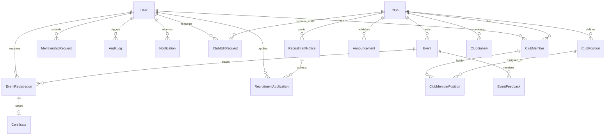

# ClubHouse — Project File Structure & Architecture Summary

A complete, production-ready university/organization club management platform built with a **Laravel 12 (PHP 8.2+)** RESTful backend and a **React 19 (Vite + Tailwind CSS)** single-page application frontend.

---

## 1. Backend File Structure (`backend/`)

```
backend/
├── app/
│   ├── Http/
│   │   ├── Controllers/                  # 22 RESTful Controllers
│   │   │   ├── AnnouncementController.php
│   │   │   ├── AuditLogController.php
│   │   │   ├── AuthController.php
│   │   │   ├── CertificateController.php
│   │   │   ├── ClubController.php
│   │   │   ├── ClubEditRequestController.php
│   │   │   ├── ClubGalleryController.php
│   │   │   ├── ClubMemberController.php
│   │   │   ├── ClubMemberPositionController.php
│   │   │   ├── ClubPositionController.php
│   │   │   ├── Controller.php           # Base controller
│   │   │   ├── DashboardController.php
│   │   │   ├── EventController.php
│   │   │   ├── EventFeedbackController.php
│   │   │   ├── EventRegistrationController.php
│   │   │   ├── MembershipRequestController.php
│   │   │   ├── NotificationController.php
│   │   │   ├── RecruitmentApplicationController.php
│   │   │   ├── RecruitmentNoticeController.php
│   │   │   ├── ReportController.php
│   │   │   ├── SearchController.php
│   │   │   └── UserController.php
│   │   │
│   │   ├── Middleware/
│   │   │   └── IsAdmin.php               # Admin privilege guard
│   │   │
│   │   └── Requests/                     # 16 Form Request classes
│   │       ├── LoginRequest.php
│   │       ├── RegisterRequest.php
│   │       ├── StoreClubRequest.php
│   │       ├── UpdateClubRequest.php
│   │       ├── StoreClubPositionRequest.php
│   │       ├── UpdateClubPositionRequest.php
│   │       ├── StoreEventRequest.php
│   │       ├── UpdateEventRequest.php
│   │       ├── StoreEventFeedbackRequest.php
│   │       ├── MarkAttendanceRequest.php
│   │       ├── StoreAnnouncementRequest.php
│   │       ├── UpdateAnnouncementRequest.php
│   │       ├── StoreMembershipRequestRequest.php
│   │       ├── StoreRecruitmentNoticeRequest.php
│   │       ├── UpdateRecruitmentNoticeRequest.php
│   │       └── StoreRecruitmentApplicationRequest.php
│   │
│   ├── Models/                           # 17 Eloquent Domain Models
│   │   ├── Announcement.php
│   │   ├── AuditLog.php
│   │   ├── Certificate.php
│   │   ├── Club.php
│   │   ├── ClubEditRequest.php
│   │   ├── ClubGallery.php
│   │   ├── ClubMember.php
│   │   ├── ClubMemberPosition.php
│   │   ├── ClubPosition.php
│   │   ├── Event.php
│   │   ├── EventFeedback.php
│   │   ├── EventRegistration.php
│   │   ├── MembershipRequest.php
│   │   ├── Notification.php
│   │   ├── RecruitmentApplication.php
│   │   ├── RecruitmentNotice.php
│   │   └── User.php
│   │
│   ├── Observers/
│   │   └── AuditObserver.php             # Automated model audit logging
│   │
│   ├── Policies/                         # 7 Authorization Policies
│   │   ├── AnnouncementPolicy.php
│   │   ├── ClubPolicy.php
│   │   ├── EventPolicy.php
│   │   ├── EventRegistrationPolicy.php
│   │   ├── MembershipRequestPolicy.php
│   │   ├── RecruitmentApplicationPolicy.php
│   │   └── RecruitmentNoticePolicy.php
│   │
│   ├── Providers/
│   │   └── AppServiceProvider.php
│   │
│   └── Services/
│       └── ClubMembershipService.php     # Membership & permission rules logic
│
├── config/                               # 12 Configuration Files
│   ├── app.php
│   ├── auth.php
│   ├── cache.php
│   ├── cors.php
│   ├── database.php
│   ├── filesystems.php
│   ├── logging.php
│   ├── mail.php
│   ├── queue.php
│   ├── sanctum.php                       # API token authentication setup
│   ├── services.php
│   └── session.php
│
├── database/
│   ├── database.sqlite                   # SQLite development database file
│   ├── factories/                        # Model factories for testing
│   ├── seeders/                          # Database seeders
│   └── migrations/                       # 41 Schema migrations
│
├── routes/
│   ├── api.php                           # Complete API endpoint routes
│   ├── console.php                       # Console command routes
│   └── web.php                           # Base web route
│
├── public/                               # Public assets & index.php entry
├── storage/                              # Uploaded files, logs, and cache
├── tests/                                # Feature and unit test suites
├── bootstrap/                            # Framework bootstrap & middleware configuration
├── composer.json / composer.lock
├── artisan
├── phpunit.xml
└── vite.config.js
```

---

## 2. Frontend File Structure (`frontend/`)

```
frontend/
├── src/
│   ├── App.jsx                           # Main application router with route protection
│   ├── main.jsx                          # React application entry point
│   ├── index.css                         # Tailwind CSS base directive imports
│   │
│   ├── components/                       # Shared UI & layout components
│   │   ├── layout/
│   │   │   ├── AppLayout.jsx             # Main layout shell with header and sidebar
│   │   │   └── Navbar.jsx                # Navigation bar with user dropdown & unread badge
│   │   ├── ui/                           # Reusable UI elements
│   │   │   ├── Badge.jsx
│   │   │   ├── Button.jsx
│   │   │   ├── Card.jsx
│   │   │   ├── ErrorBanner.jsx
│   │   │   ├── LoadingSpinner.jsx
│   │   │   ├── Modal.jsx
│   │   │   └── SuccessBanner.jsx
│   │   └── clubs/                        # Club specific components
│   │       ├── ClubCard.jsx
│   │       ├── MembershipRequestList.jsx
│   │       └── PositionAssignment.jsx
│   │
│   ├── context/                          # React Context Providers
│   │   ├── AuthContext.jsx               # Auth state, login, logout, user profile
│   │   └── ClubPermissionsContext.jsx    # Club-level executive permission resolver
│   │
│   ├── pages/                            # 13 Page Feature Folders
│   │   ├── Admin/                        # AdminClubList, AdminUsers, AdminAuditLogs, AdminReports
│   │   ├── Announcements/                # AnnouncementList
│   │   ├── Certificates/                 # MyCertificates
│   │   ├── Clubs/                        # ClubList, ClubDetail, CreateClub, ClubEditForm, ClubMembers
│   │   ├── Dashboard/                    # Dashboard
│   │   ├── Events/                       # EventsPage, EventDetailPage, EventAttendance, EventForm
│   │   ├── Login/                        # Login
│   │   ├── Notifications/                # NotificationList
│   │   ├── Profile/                      # ProfilePage
│   │   ├── Recruitment/                  # RecruitmentList, RecruitmentDetail, RecruitmentApplications
│   │   ├── Register/                     # Register
│   │   ├── Search/                       # SearchPage
│   │   └── Users/                        # User administration components
│   │
│   ├── routes/                           # Route Protection Guards
│   │   ├── ProtectedRoute.jsx            # Authentication guard
│   │   ├── AdminRoute.jsx                # Platform Admin guard
│   │   └── ClubExecutiveRoute.jsx        # Club Executive guard
│   │
│   └── services/                         # 11 Service Layer Modules
│       ├── adminService.js
│       ├── announcementService.js
│       ├── api.js                        # Axios instance with Bearer token interceptor
│       ├── authService.js
│       ├── certificateService.js
│       ├── clubService.js
│       ├── eventService.js
│       ├── membershipService.js
│       ├── notificationService.js
│       ├── recruitmentService.js
│       └── searchService.js
│
├── public/                               # Static public assets
├── package.json / package-lock.json
├── tailwind.config.js
├── postcss.config.js
├── vite.config.js
└── .oxlintrc.json
```

---

## 3. Entity Relationship Diagram (ERD)


