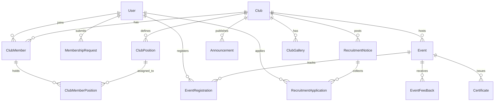

# ClubHouse — Project File Structure Summary

A university/organization club management platform with a **Laravel (PHP)** backend and a **React (Vite + Tailwind)** frontend.

---

## Backend (Laravel)

```
backend/
├── app/
│   ├── Http/
│   │   ├── Controllers/            # 19 controllers
│   │   │   ├── AuthController.php
│   │   │   ├── ClubController.php
│   │   │   ├── ClubMemberController.php
│   │   │   ├── ClubMemberPositionController.php
│   │   │   ├── ClubPositionController.php
│   │   │   ├── ClubGalleryController.php
│   │   │   ├── EventController.php
│   │   │   ├── EventRegistrationController.php
│   │   │   ├── EventFeedbackController.php
│   │   │   ├── AnnouncementController.php
│   │   │   ├── CertificateController.php
│   │   │   ├── MembershipRequestController.php
│   │   │   ├── RecruitmentNoticeController.php
│   │   │   ├── RecruitmentApplicationController.php
│   │   │   ├── NotificationController.php
│   │   │   ├── AuditLogController.php
│   │   │   ├── ReportController.php
│   │   │   ├── UserController.php
│   │   │   └── Controller.php            # Base controller
│   │   ├── Middleware/
│   │   │   └── IsAdmin.php                # Admin role guard
│   │   └── Requests/              # 16 form request validators
│   │       ├── LoginRequest.php
│   │       ├── RegisterRequest.php
│   │       ├── StoreClubRequest.php
│   │       ├── UpdateClubRequest.php
│   │       ├── StoreClubPositionRequest.php
│   │       ├── UpdateClubPositionRequest.php
│   │       ├── StoreEventRequest.php
│   │       ├── UpdateEventRequest.php
│   │       ├── StoreEventFeedbackRequest.php
│   │       ├── MarkAttendanceRequest.php
│   │       ├── StoreAnnouncementRequest.php
│   │       ├── UpdateAnnouncementRequest.php
│   │       ├── StoreMembershipRequestRequest.php
│   │       ├── StoreRecruitmentNoticeRequest.php
│   │       ├── UpdateRecruitmentNoticeRequest.php
│   │       └── StoreRecruitmentApplicationRequest.php
│   ├── Models/                    # 16 Eloquent models
│   │   ├── User.php
│   │   ├── Club.php
│   │   ├── ClubMember.php
│   │   ├── ClubMemberPosition.php
│   │   ├── ClubPosition.php
│   │   ├── ClubGallery.php
│   │   ├── Event.php
│   │   ├── EventRegistration.php
│   │   ├── EventFeedback.php
│   │   ├── Announcement.php
│   │   ├── Certificate.php
│   │   ├── MembershipRequest.php
│   │   ├── RecruitmentNotice.php
│   │   ├── RecruitmentApplication.php
│   │   ├── Notification.php
│   │   └── AuditLog.php
│   ├── Observers/
│   │   └── AuditObserver.php              # Audit trail logging
│   ├── Policies/                  # 7 authorization policies
│   │   ├── ClubPolicy.php
│   │   ├── EventPolicy.php
│   │   ├── EventRegistrationPolicy.php
│   │   ├── AnnouncementPolicy.php
│   │   ├── MembershipRequestPolicy.php
│   │   ├── RecruitmentNoticePolicy.php
│   │   └── RecruitmentApplicationPolicy.php
│   ├── Providers/
│   │   └── AppServiceProvider.php
│   └── Services/
│       └── ClubMembershipService.php      # Membership business logic
│
├── config/                        # 12 config files
│   ├── app.php
│   ├── auth.php
│   ├── cache.php
│   ├── cors.php
│   ├── database.php
│   ├── filesystems.php
│   ├── logging.php
│   ├── mail.php
│   ├── queue.php
│   ├── sanctum.php                        # API token auth
│   ├── services.php
│   └── session.php
│
├── database/
│   ├── database.sqlite                    # SQLite dev database
│   ├── factories/
│   ├── seeders/
│   └── migrations/                # 20 migrations
│       ├── *_create_users_table
│       ├── *_create_cache_table
│       ├── *_create_jobs_table
│       ├── *_create_personal_access_tokens_table
│       ├── *_create_clubs_table
│       ├── *_create_club_positions_table
│       ├── *_create_club_members_table
│       ├── *_create_club_member_positions_table
│       ├── *_create_membership_requests_table
│       ├── *_create_events_table
│       ├── *_create_event_registrations_table
│       ├── *_create_certificates_table
│       ├── *_create_announcements_table
│       ├── *_create_recruitment_notices_table
│       ├── *_create_recruitment_applications_table
│       ├── *_create_event_feedback_table
│       ├── *_create_notifications_table
│       ├── *_create_audit_logs_table
│       ├── *_create_club_galleries_table
│       └── *_add_is_members_only_to_events_table
│
├── routes/
│   ├── api.php                    # API route definitions
│   ├── web.php                    # Web routes (minimal)
│   └── console.php                # Artisan console routes
│
├── public/                        # Public assets
├── resources/                     # Blade views / assets
├── storage/                       # Logs, cache, uploads
├── tests/                         # PHPUnit tests
├── bootstrap/                     # Framework bootstrap
├── vendor/                        # Composer dependencies
│
├── .env / .env.example
├── composer.json / composer.lock
├── artisan
├── phpunit.xml
└── vite.config.js
```

### Key Backend Patterns

| Concept | Details |
|---|---|
| **Auth** | Laravel Sanctum (token-based API auth) |
| **Authorization** | Policy-based (`Policies/`) + `IsAdmin` middleware |
| **Validation** | Dedicated Form Request classes (`Requests/`) |
| **Auditing** | Observer-based audit logging (`AuditObserver`) |
| **Database** | SQLite (dev), 20 migrations covering all domain tables |

---

## Frontend (React + Vite + Tailwind CSS)

```
frontend/
├── src/
│   ├── App.jsx                    # Root app component with routing
│   ├── App.css                    # Global styles
│   ├── main.jsx                   # Vite entry point
│   ├── index.css                  # Tailwind base imports
│   │
│   ├── components/
│   │   ├── layout/
│   │   │   ├── AppLayout.jsx              # Main layout wrapper
│   │   │   └── Navbar.jsx                 # Top navigation bar
│   │   ├── ui/                    # Reusable UI primitives
│   │   │   ├── Badge.jsx
│   │   │   ├── Button.jsx
│   │   │   ├── Card.jsx
│   │   │   ├── Modal.jsx
│   │   │   ├── ErrorBanner.jsx
│   │   │   ├── SuccessBanner.jsx
│   │   │   └── LoadingSpinner.jsx
│   │   ├── clubs/                 # Club-specific components
│   │   │   ├── ClubCard.jsx
│   │   │   ├── MembershipRequestList.jsx
│   │   │   └── PositionAssignment.jsx
│   │   ├── Button/                # (legacy/alternate Button)
│   │   ├── Modal/                 # (legacy/alternate Modal)
│   │   ├── Navbar/                # (legacy/alternate Navbar)
│   │   └── Sidebar/               # Sidebar component
│   │
│   ├── pages/                     # 12 page modules
│   │   ├── Admin/
│   │   ├── Announcements/
│   │   ├── Certificates/
│   │   ├── Clubs/
│   │   ├── Dashboard/
│   │   ├── Events/
│   │   ├── Login/
│   │   ├── Register/
│   │   ├── Profile/
│   │   ├── Notifications/
│   │   ├── Recruitment/
│   │   └── Users/
│   │
│   ├── services/                  # API service layer (10 files)
│   │   ├── api.js                         # Axios instance config
│   │   ├── authService.js
│   │   ├── clubService.js
│   │   ├── eventService.js
│   │   ├── membershipService.js
│   │   ├── announcementService.js
│   │   ├── certificateService.js
│   │   ├── recruitmentService.js
│   │   ├── notificationService.js
│   │   └── adminService.js
│   │
│   ├── context/                   # React Context providers
│   │   ├── AuthContext.jsx                # Auth state management
│   │   └── ClubPermissionsContext.jsx     # Club-level permissions
│   │
│   ├── routes/                    # Route guards
│   │   ├── ProtectedRoute.jsx             # Auth-required guard
│   │   ├── AdminROute.jsx                 # Admin-only guard
│   │   └── ClubExecutiveRoute.jsx         # Club executive guard
│   │
│   ├── hooks/                     # (empty — custom hooks)
│   ├── utils/                     # (empty — utilities)
│   └── assets/                    # Static assets
│
├── public/                        # Public static files
├── node_modules/                  # npm dependencies
│
├── index.html                     # Vite HTML entry
├── package.json / package-lock.json
├── vite.config.js
├── tailwind.config.js
├── postcss.config.js
└── .oxlintrc.json                 # Linter config
```

### Key Frontend Patterns

| Concept | Details |
|---|---|
| **Build Tool** | Vite |
| **Styling** | Tailwind CSS |
| **API Layer** | Axios-based service modules (`services/`) |
| **Auth** | React Context (`AuthContext`) + Sanctum tokens |
| **Routing** | React Router with 3 route guards (Protected, Admin, Club Executive) |
| **State** | Context API for auth & club permissions |

---

## Domain Model Overview


