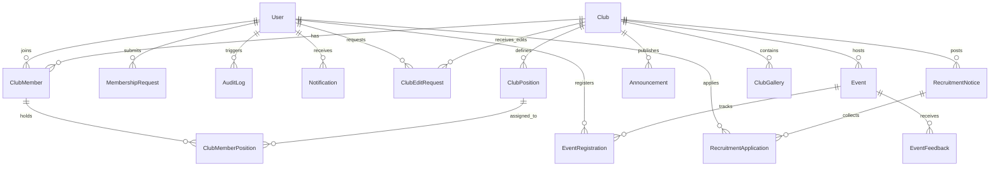

# ClubHouse — Project File Structure & Architecture Summary

A complete, production-ready university/organization club management platform built with a **Laravel 12 (PHP 8.2+)** RESTful backend and a **React 19 (Vite + Tailwind CSS)** single-page application frontend.

---

## 1. Backend File Structure (`backend/`)

```
backend/
├── app/
│   ├── Console/
│   │   └── Commands/                     # Console commands & scheduled tasks
│   │       └── UpdateEventStatuses.php   # Lifecycle auto-transition (Upcoming -> Ongoing -> Completed)
│   │
│   ├── Http/
│   │   ├── Controllers/                  # 21 RESTful Controllers
│   │   │   ├── AnnouncementController.php
│   │   │   ├── AuditLogController.php
│   │   │   ├── AuthController.php
│   │   │   ├── ClubController.php
│   │   │   ├── ClubEditRequestController.php
│   │   │   ├── ClubGalleryController.php
│   │   │   ├── ClubMemberController.php
│   │   │   ├── ClubMemberPositionController.php
│   │   │   ├── ClubPositionController.php
│   │   │   ├── Controller.php           # Base controller
│   │   │   ├── DashboardController.php
│   │   │   ├── EventController.php
│   │   │   ├── EventFeedbackController.php
│   │   │   ├── EventRegistrationController.php
│   │   │   ├── MembershipRequestController.php
│   │   │   ├── NotificationController.php
│   │   │   ├── RecruitmentApplicationController.php
│   │   │   ├── RecruitmentNoticeController.php
│   │   │   ├── ReportController.php
│   │   │   ├── SearchController.php
│   │   │   └── UserController.php
│   │   │
│   │   ├── Middleware/                   # Custom HTTP Middleware
│   │   │   ├── IsAdmin.php               # Platform Admin privilege guard
│   │   │   └── SecurityHeaders.php       # Security header hardening (CSP, HSTS, X-Frame-Options)
│   │   │
│   │   └── Requests/                     # 18 Form Request validation classes
│   │       ├── CreateClubRequest.php
│   │       ├── LoginRequest.php
│   │       ├── MarkAttendanceRequest.php
│   │       ├── RegisterRequest.php
│   │       ├── StoreAnnouncementRequest.php
│   │       ├── StoreClubPositionRequest.php
│   │       ├── StoreClubRequest.php
│   │       ├── StoreEventFeedbackRequest.php
│   │       ├── StoreEventRequest.php
│   │       ├── StoreMembershipRequestRequest.php
│   │       ├── StoreRecruitmentApplicationRequest.php
│   │       ├── StoreRecruitmentNoticeRequest.php
│   │       ├── UpdateAnnouncementRequest.php
│   │       ├── UpdateClubPositionRequest.php
│   │       ├── UpdateClubRequest.php
│   │       ├── UpdateEventRequest.php
│   │       ├── UpdateEventStatusRequest.php
│   │       └── UpdateRecruitmentNoticeRequest.php
│   │
│   ├── Models/                           # 16 Eloquent Domain Models
│   │   ├── Announcement.php
│   │   ├── AuditLog.php
│   │   ├── Club.php
│   │   ├── ClubEditRequest.php
│   │   ├── ClubGallery.php
│   │   ├── ClubMember.php
│   │   ├── ClubMemberPosition.php
│   │   ├── ClubPosition.php
│   │   ├── Event.php
│   │   ├── EventFeedback.php
│   │   ├── EventRegistration.php
│   │   ├── MembershipRequest.php
│   │   ├── Notification.php
│   │   ├── RecruitmentApplication.php
│   │   ├── RecruitmentNotice.php
│   │   └── User.php
│   │
│   ├── Observers/
│   │   └── AuditObserver.php             # Automated model audit logging dispatcher
│   │
│   ├── Policies/                         # 7 Authorization Policies
│   │   ├── AnnouncementPolicy.php
│   │   ├── ClubPolicy.php
│   │   ├── EventPolicy.php
│   │   ├── EventRegistrationPolicy.php
│   │   ├── MembershipRequestPolicy.php
│   │   ├── RecruitmentApplicationPolicy.php
│   │   └── RecruitmentNoticePolicy.php
│   │
│   ├── Providers/
│   │   └── AppServiceProvider.php
│   │
│   └── Services/                         # 4 Core Business Logic & Domain Services
│       ├── AuditService.php              # Centralized action & change auditing logger
│       ├── CacheInvalidationService.php  # Tagged response & model cache clearing
│       ├── ClubMembershipService.php     # Membership lifecycle & permission checks
│       └── NotificationService.php       # System-wide in-app notifications creator
│
├── config/                               # 12 Framework Configuration Files
│   ├── app.php
│   ├── auth.php
│   ├── cache.php
│   ├── cors.php
│   ├── database.php
│   ├── filesystems.php
│   ├── logging.php
│   ├── mail.php
│   ├── queue.php
│   ├── sanctum.php                       # API token authentication setup
│   ├── services.php
│   └── session.php
│
├── database/
│   ├── database.sqlite                   # SQLite development database file
│   ├── factories/                        # Model factories for testing
│   ├── seeders/                          # Database seeders
│   └── migrations/                       # 55 Schema migrations
│
├── routes/
│   ├── api.php                           # Complete API endpoint routes
│   ├── console.php                       # Console command routes
│   └── web.php                           # Base web route
│
├── tests/                                # Test Suite (19 Feature, 1 Unit)
│   ├── Feature/                          # Controller, API, & Business logic feature tests
│   └── Unit/                             # Unit tests
│
├── public/                               # Public assets & index.php entry point
├── storage/                              # Uploaded files, logs, and framework cache
├── bootstrap/                            # Framework bootstrap & middleware configuration
├── composer.json / composer.lock
├── artisan
├── phpunit.xml
└── vite.config.js
```

---

## 2. Frontend File Structure (`frontend/`)

```
frontend/
├── src/
│   ├── App.jsx                           # Main application router with route protection
│   ├── main.jsx                          # React application entry point
│   ├── index.css                         # Tailwind CSS base imports & custom styles
│   │
│   ├── assets/                           # Static visual assets & SVGs
│   │   ├── hero.png
│   │   ├── react.svg
│   │   └── vite.svg
│   │
│   ├── layouts/                          # Top-level application layout shells
│   │   └── MainLayout.jsx                # Unified header, search, notification drawer, & container
│   │
│   ├── components/                       # Shared UI & layout components
│   │   ├── admin/
│   │   │   └── UserManagementSection.jsx # User management administrative table
│   │   │
│   │   ├── Clubs/                        # Club-specific modal & display components
│   │   │   ├── AddCommitteeMemberModal.jsx
│   │   │   ├── ClubAuditLogModal.jsx
│   │   │   ├── ClubCard.jsx
│   │   │   ├── EditAdvisorModal.jsx
│   │   │   ├── EditClubModal.jsx
│   │   │   ├── MembersDirectory.jsx
│   │   │   ├── MembershipRequestList.jsx
│   │   │   ├── PositionAssignment.jsx
│   │   │   └── TransferPresidencyModal.jsx
│   │   │
│   │   ├── Events/                       # Event management & feedback components
│   │   │   ├── AttendanceReportModal.jsx
│   │   │   ├── EventFeedbackModal.jsx
│   │   │   ├── EventModal.jsx
│   │   │   ├── FeedbackListModal.jsx
│   │   │   └── ViewResponsesModal.jsx
│   │   │
│   │   ├── layout/                       # Utility layout elements
│   │   │   └── SearchBar.jsx             # Topbar dynamic search input
│   │   │
│   │   └── ui/                           # Reusable UI primitives
│   │       ├── Badge.jsx
│   │       ├── Button.jsx
│   │       ├── Card.jsx
│   │       ├── ErrorBanner.jsx
│   │       ├── ErrorBoundary.jsx         # React error boundary component
│   │       ├── LoadingSpinner.jsx
│   │       ├── Modal.jsx
│   │       └── SuccessBanner.jsx
│   │
│   ├── context/                          # React Context Providers
│   │   ├── AuthContext.jsx               # Authentication, token persistence, & user state
│   │   └── ClubPermissionsContext.jsx    # Dynamic club-level executive permission resolver
│   │
│   ├── hooks/                            # Custom React Hooks
│   │   └── useDebounce.js                # Input debouncing hook for live search
│   │
│   ├── pages/                            # 11 Page Feature Folders
│   │   ├── Admin/                        # AdminAuditLogs, AdminClubList, AdminReports, AdminUsers
│   │   ├── Announcements/                # AnnouncementList
│   │   ├── Clubs/                        # ClubList, ClubDetail, CreateClub
│   │   ├── Dashboard/                    # Unified Role Dashboard (Student, Executive, Admin)
│   │   ├── Events/                       # EventsPage, EventDetailPage
│   │   ├── Login/                        # Login
│   │   ├── Notifications/                # NotificationList
│   │   ├── Profile/                      # ProfilePage
│   │   ├── Recruitment/                  # RecruitmentList, RecruitmentDetail, RecruitmentApplications
│   │   ├── Register/                     # Register
│   │   └── Search/                       # SearchPage
│   │
│   ├── routes/                           # Route Protection Guards
│   │   ├── ProtectedRoute.jsx            # Authentication guard
│   │   ├── AdminROute.jsx                # Platform Admin guard
│   │   └── ClubExecutiveRoute.jsx        # Club Executive guard
│   │
│   ├── services/                         # 11 Service Layer Modules
│   │   ├── adminService.js               # Admin management endpoints
│   │   ├── announcementService.js        # Announcement CRUD & targeting endpoints
│   │   ├── api.js                        # Axios instance with auth request interceptors
│   │   ├── apiCache.js                   # Client-side response caching & TTL manager
│   │   ├── authService.js                # Authentication & user profile endpoints
│   │   ├── clubService.js                # Club details, edit requests, & gallery API
│   │   ├── eventService.js               # Events, attendance, & feedback API
│   │   ├── membershipService.js          # Membership request management API
│   │   ├── notificationService.js        # User notifications API
│   │   ├── recruitmentService.js         # Notices & application pipeline API
│   │   └── searchService.js              # Global search endpoint API
│   │
│   └── utils/                            # 7 Utility Helper Modules
│       ├── auditLogUtils.js              # Audit log formatting helpers
│       ├── dateUtils.js                  # Date & relative timestamp formatters
│       ├── imageCompressor.js            # Client-side image optimization
│       ├── imageUrl.js                   # Image URL resolution & storage path handler
│       ├── notificationUtils.js          # In-app notification transformers
│       ├── roleUtils.js                  # User role check helpers
│       └── sessionUtils.js               # Academic session calculation utilities
│
├── public/                               # Static public assets
├── package.json / package-lock.json
├── tailwind.config.js
├── postcss.config.js
├── vite.config.js
└── .oxlintrc.json
```

---

## 3. Entity Relationship Diagram (ERD)


